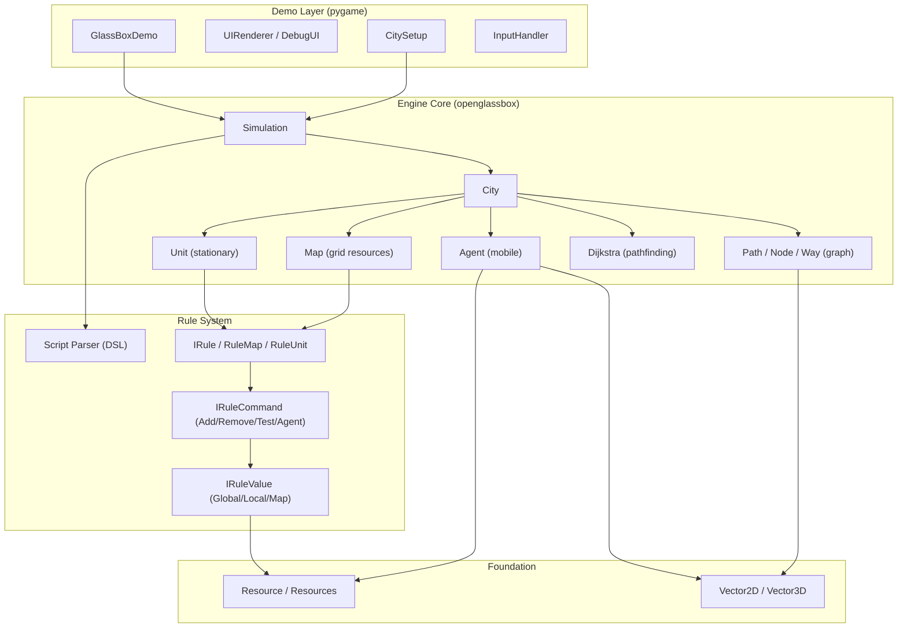

# Architecture Overview

> A detailed system design visualization is available locally in `.system-design-visualization`.
> Generate it by running the system-design-visualizer agent.

## Summary

OpenGlassBox-Python is a Python port of the C++ [OpenGlassBox](https://github.com/Lecrapouille/OpenGlassBox) simulation engine, inspired by the Maxis SimCity 2013 GlassBox architecture. It models city economies through resource production, transportation, and consumption using an agent-based system driven by a declarative rule engine.

## High-Level Architecture



## Key Components

| Component | Location | Purpose |
|-----------|----------|---------|
| **Simulation** | `openglassbox/simulation.py` | Top-level orchestrator managing cities and the tick-based update loop |
| **City** | `openglassbox/city.py` | Container coordinating Maps, Paths, Units, and Agents |
| **Map** | `openglassbox/map.py` | 2D grid storing per-cell resource values with radius operations |
| **Path / Node / Way** | `openglassbox/path.py`, `node.py` | Graph-based transportation network (nodes = vertices, ways = edges) |
| **Unit** | `openglassbox/unit.py` | Stationary entity (building) attached to a Node, holds resources, executes rules |
| **Agent** | `openglassbox/agent.py` | Mobile entity that carries resources between Units along Paths |
| **Dijkstra** | `openglassbox/dijkstra.py` | A*-like pathfinding for Agent route calculation |
| **Rule System** | `openglassbox/rule.py`, `rule_command.py`, `rule_value.py` | Declarative rule engine with two-phase validate-then-execute pattern |
| **Script Parser** | `openglassbox/script_parser.py` | Custom DSL parser for simulation configuration files |
| **Resource(s)** | `openglassbox/resource.py`, `resources.py` | Type-amount-capacity resource model and heterogeneous container |
| **Demo** | `demo/src/demo.py` | Pygame visualization with camera, layer toggles, and debug overlays |

## Core Data Flow

1. **Script Parsing**: A `.txt` DSL file defines resources, paths, agents, rules, units, and maps
2. **City Construction**: Cities are populated with Paths (graph), Maps (grids), and Units (buildings)
3. **Simulation Loop**: At 200 ticks/second, each City updates Agents, then Units, then Maps
4. **Rule Execution**: Units and Maps execute rules that add/remove resources and spawn Agents
5. **Agent Transport**: Agents use Dijkstra pathfinding to carry resources between Units
6. **Resource Transfer**: Agents unload resources at destination Units that match their search target

## Tech Stack

- **Language**: Python 3.8+
- **Visualization**: pygame 2.0+
- **Testing**: pytest with coverage
- **Build**: setuptools via pyproject.toml
- **Documentation**: Sphinx (optional)

## Project Layout

```
openglassbox/      Core simulation engine (18 modules)
demo/              Pygame demo application
  src/             Demo source (6 modules + Display/debug_ui.py)
  data/            Simulation scenario files (TestCity.txt)
tests/             Test suite (23 test files)
docs/              Developer guide, DSL spec, porting notes
```

## Architectural Patterns

- **Observer**: Simulation and City use Listener interfaces for entity lifecycle events
- **Strategy**: IRuleValue/IRuleCommand provide pluggable rule behavior
- **Two-Phase Commit**: Rules validate all commands before executing any
- **Flyweight**: Type definitions (MapType, UnitType, etc.) are shared across instances
- **Lazy Import**: City defers imports to break circular dependencies
