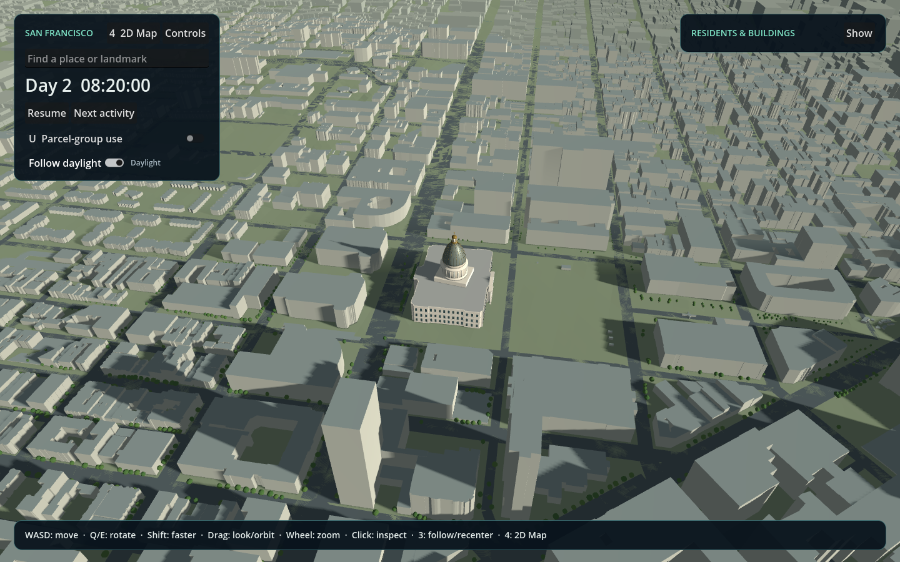

# SF-city

Explore a living San Francisco, and the engineering behind making it run better.

SF-city is a desktop simulation for following how people move through a city.
Start around City Hall, explore recognizable places, follow a resident's commute,
and inspect how buildings fill and empty throughout the day.

The project combines imported San Francisco streets, building footprints, and
terrain with synthetic residents, jobs, and schedules. It is a working prototype
for exploration and experimentation; population calibration remains future work.



*City Hall and its surrounding streets in the working prototype.*

## Features and their impact

| Feature | What it improves | Result today |
| --- | --- | --- |
| City geography and place search | Finding a familiar place to explore | Navigate streets, landmarks, and named areas when their data is installed. |
| Persistent residents and building inspection | Understanding individual behavior | Follow people from home to work and back, and inspect changing occupancy. |
| 3D exploration and a lightweight 2D map | Choosing the right view for the question | Inspect agent activity with 3D rendering disabled while the same simulation continues. |
| Prepared scenery and visible loading progress | Time spent waiting to explore | Recorded usable-view time fell **46.6 to 14.1 seconds**, with loading stages and cancellation. |
| Save/resume and activity controls | Returning to a useful point in an experiment | Restore a saved simulation state, pause, or jump to the next scheduled activity. |
| JSON logs and local hardware reporting | Diagnosing slowdowns and performance changes | Correlate CPU, memory, disk and available GPU readings with loading and frame timings; retain recent history and run-wide peaks. |
| Live population controls and a performance console | Exploring how a larger workload affects the computer | Add/remove synthetic citizens during the current day and inspect frame, simulation, and hardware readings beside filterable logs. |
| Flexible desktop layout | Keeping the city and its controls usable on wider screens | Resize panels, use fullscreen, and adjust interface scale. |

### Measured startup improvement

**32.5 seconds saved, or 69.8% less waiting**, in the recorded City Hall comparison.

This was one historical paused 200-resident replay per condition, using Godot
4.7.2 and an NVIDIA GTX 1070 Ti. It measures time inside the viewer until the
starting view is usable, excluding engine launch and offline preparation.
Preprocessing and accompanying startup changes contributed to the comparison;
the result does not isolate caching alone.

Full-city preparation took about **4 minutes 28 seconds** in the recorded run.
Prepared geometry can then be reused while its inputs remain valid, trading disk
space and advance preparation for less repeated work.

See the [patch note](docs/PATCH_NOTES.md) and
[benchmark evidence](docs/benchmarks/2026-09-06-prepared-scenery.json) for exact
figures and conditions. The other rows describe current capabilities; this
README highlights the measured startup comparison.

## Decisions behind the product

[Runnable engine comparisons](comparison/README.md) informed the move to Godot.
Godot presents the city, Python owns resident behavior, and optional Rust helpers
accelerate selected operations. The 2D view makes agent activity easier to
inspect; prepared scenery reduces repeated geometry construction.

Each iteration connects a user problem to a feature, an observable outcome, and
evidence. This README keeps those outcomes easy to scan.
[Patch notes](docs/PATCH_NOTES.md) preserve the dated changes and measurement
details as the product evolves.

## Try it

Use Python 3.10+ and Godot 4; the tested Godot version is 4.7.2. Make the executable
available on PATH or set `GODOT_BIN`, then run from this repository's root:

```powershell
python -m civic_center
```

A fresh checkout opens the stylized City Hall pilot. Full-city datasets and
prepared caches are local downloads or generated files, so they are not included
in Git.

See [setup and controls](civic_center/README.md),
[city data preparation and attribution](docs/SF_GEOGRAPHY.md), and
[Windows packaging](docs/WINDOWS_BUILD.md) for the complete setup.

## Next priorities

Improve population realism, measure behavior across larger cohorts, and make
dense-city exploration more responsive. Citywide geography is available; a
calibrated simulation of San Francisco's actual population is still a goal.

## Credits and lineage

SF-city grew from the [OpenGlassBox Python-port project](https://github.com/jamesEmerson112/OpenGlassBox-Python).
The retained legacy engine credits **Quentin Quadrat's
[OpenGlassBox](https://github.com/Lecrapouille/OpenGlassBox)** and preserves the
older implementation. SF-city's resident simulation and Godot application are
developed separately.

The [historical upstream reference](https://github.com/Lecrapouille/OpenGlassBox/blob/9e23535462cb0367c0b543211a672b1e431e6798/Makefile.common)
declares **0.2.0 / C++14**, consistent with the port's May 2025 origins. The exact
upstream checkout used for the port was not recorded; this reference identifies
its historical lineage rather than an exact verified dependency pin.

That lineage also includes Federico D'Angelo's
[MultiAgentSimulation](https://github.com/federicodangelo/MultiAgentSimulation)
and Andrew Willmott's
[Inside GlassBox presentation](http://www.andrewwillmott.com/talks/inside-glassbox).

MIT licensed. See [LICENSE](LICENSE) for the preserved copyright notices.
