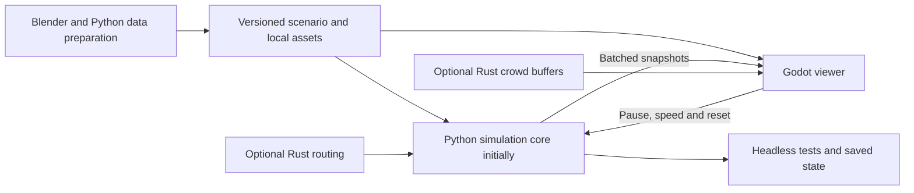

# Godot implementation plan

Decision recorded September 5, 2026: **Godot is the selected engine** for the
desktop San Francisco application. On September 6 the user explicitly confirmed
the target is the actual extent of San Francisco. City Hall remains the detailed
starting area and a behavioral reference for the larger city.

The first application foundation is implemented in `civic_center/` and `viewer/`:
persistent residents, live snapshots, inspection, deterministic save/resume and
headless/rendered checks. Current evidence is in
[OVERNIGHT_PROGRESS.md](OVERNIGHT_PROGRESS.md). The ordered work below records
the architecture and later acceptance gates; it is not a claim that every stage
has passed.

The first playable milestone is complete: persistent residents commute from home
to work and back, with matching identity, location, activity and occupancy.
Current city scenarios repeat those schedules over later days. The next work
improves city exploration, measured busy-population performance and data coverage.

## Current application, September 6

| Area | Implemented and measured | Remaining boundary |
|---|---|---|
| City geography | Official mainland/island shoreline, active street graph, 177,140 building parts, tiled detail and terrain | Older footprint vintage, incomplete distant-island detail, no universal facade survey |
| Resident behavior | Seeded home/work assignments, repeated commutes, stable identity, occupancy and exact resume | Synthetic residents and employers; no calibrated demographics or travel-mode choice |
| Building use | Exact parcel-group joins, positive home/work eligibility, observed-use colors and group-aware inspection | Source groups cannot locate each use within an individual footprint |
| Navigation | Overhead, walk and follow; searchable analysis areas, Rec/Park properties and skyline landmarks; selected source boundaries | Navigation street points are not surveyed entrances or sidewalk access claims |
| City detail | Four landmark exteriors, representative daylight, nearby facade patterns and recorded street-tree locations | Architectural details and vegetation shapes are illustrative; the tree source is not all park vegetation |
| Performance | Optional Rust router, compact live geometry, background decoder, bounded process jobs and compressed checkpoints | Last busy 1,000-person frame p95 was around 70 ms; smooth whole-population rendering is not established |
| Delivery | Independent portable Python/Godot launch and per-file verification | Fresh native/fallback builds and current city integration are revalidated as changes land |

## Decisions and planning assumptions

- **Confirmed:** Godot, desktop window, overhead and ground exploration, City Hall
  first, detailed architecture, adjustable population, and eventual geography
  and aggregate behavior grounded in available San Francisco data.
- **Language assumption:** connect the existing Python simulation first and adopt
  Rust gradually. The user expressed interest in Rust but has not requested an
  immediate rewrite. Rust timing is an optional clarification; it does not reopen
  the Godot decision or block the common scenario and snapshot design.
- **Initial presentation:** reuse the tested Compatibility renderer, Blender GLB,
  camera controls, picking and seven-part character rendering. Evaluate improved
  materials, skeletal animation and other renderer settings after live behavior.
- **Pilot scope:** one home, one workplace and a connected walking graph first;
  then a small cohort and 200 residents. The 1,000/5,000 presets remain synthetic
  stress scenarios until integrated performance is measured.
- **Citywide scope:** import authentic mainland and island geography; retain
  high detail near City Hall and load other areas in spatial tiles. Generate a
  transparent synthetic commuting cohort across the real street network first,
  then calibrate household/job totals to published aggregate data. Map coverage,
  resident count and architectural detail are independently measured milestones.
- **Development scope:** focus new application work on Godot. Keep the six
  comparison demos as references; no further parallel engine feature development.

## What already works and what must change

The [round-two validation](../comparison/VALIDATION.md) records GLB imports,
camera modes, picking, nearby gait and population controls. These checks do not
establish daily schedules, arrival, occupancy or real geography.

| Existing component | Reuse | Necessary change |
|---|---|---|
| `comparison/godot/main.gd` | Cameras, building selection, UI layout, axis conversion | Split application responsibilities and receive simulation state; playback controls become commands. |
| `comparison/godot/crowd.gd` and `crowd.gdshader` | Seven MultiMeshes, appearance, nearby articulation | Replace both CPU and GPU route sampling with the same snapshot-derived transforms. Picking/follow must use the displayed transform. |
| `comparison/shared/civic-center.blend` and `.glb` | Original architecture and stable building extras | Package runtime assets inside the application; preserve editable source and provenance. |
| `openglassbox/simulation.py` | Fixed-timestep coordination | Define exact tick advancement. Existing `step()` calls `update(1.0)` and is not one tick. The update cap leaves pending time that must be accounted for. |
| `openglassbox/agent.py` and `city.py` | Existing resource-carrier behavior | Add persistent residents separately. Carriers disappear after unloading; resident identity cannot depend on carrier lifetime or list index. |
| `openglassbox/path.py` and `dijkstra.py` | Graph data concepts | Add explicit origin/destination walking routes. Existing search targets resource acceptance, permits random fallback, and is not verified shortest-path routing. |

## Architecture and ownership

The simulation owns stable resident/building IDs, the clock, schedules, complete
routes, movement, arrival, occupancy and saved state. Godot owns camera movement,
selection, visual interpolation and detail levels. A person may become invisible
inside a building while remaining selectable through their persistent record.
Camera position and visibility must never determine who exists in the simulation.

The worker connection uses authenticated loopback TCP and newline-delimited JSON
messages. Python can use its standard library; Godot exposes `StreamPeerTCP`.
The viewer must poll without blocking a frame and assemble complete messages
across partial reads. This transport is an implementation choice for the small
pilot, not a throughput claim. [Godot TCP interface](https://docs.godotengine.org/en/stable/classes/class_streampeertcp.html).

Keep the transport behind a snapshot adapter. A future Rust GDExtension can call
the same viewer-facing interface inside the Godot process; it need not serialize
JSON or keep a Python worker for functionality that has migrated.
[Rust extension loading](https://godot-rust.github.io/book/intro/hello-world.html).

## Scenario, commands and snapshots

Define a versioned contract in `contracts/` before connecting live movement.

| Record | Required meaning |
|---|---|
| Scenario | Version/hash, source manifest, local origin and units, asset checksums, buildings/entrances, walking nodes/edges and initial resident assignments. |
| Resident | Stable ID, home/work IDs, activity, position, heading, and optional current trip ID/segment/progress. Include these fields in each snapshot resident record. |
| Trip | Stable ID/version, explicit destination, complete route, segment/progress, departure and arrival ticks/state, or an inspectable unreachable outcome. Snapshots include the trip or reference immutable trip data already supplied to the viewer. |
| Snapshot | Protocol/scenario version, session ID, sequence, completed tick, simulation time, acknowledged pause/speed, residents and building occupancy. |
| Command | Unique request ID and action: pause/resume, speed or deterministic reset. Acknowledgment identifies when it took effect. |

Use local meters `(east, north, up)` throughout domain records; map positions to
Godot `(east, up, -north)` once. Standard glTF import already converts the static
asset, so do not apply the dynamic-position conversion to it a second time.
Namespace IDs across graphs and buildings. Match render slots to resident IDs,
not incoming array positions, so selection survives reordered snapshots.

Start with complete snapshots at a provisional 10 Hz for the small cohort.
Interpolate only between authoritative states, handle corners using route/segment
data, and stop at arrivals. Gait follows actual travel and freezes while paused;
standing residents must not keep walking in place. When no fresh snapshot is
available, show a connection state and stop predicting beyond the latest state.
Apply activity, occupancy and inspector transitions at the same displayed tick
as arrival. If a transition cannot be interpolated safely, snap the position and
related displayed state together. The inspector must not report someone at work
while the displayed person is still approaching it.

Bound buffered messages and snapshot size. Older pending render snapshots may be
superseded by a newer complete snapshot; commands and acknowledgments cannot be
silently dropped. Reject stale sequences and reset interpolation on a new session.
Preserve authoritative occupancy in every complete snapshot so skipping a visual
update cannot lose an arrival. Reconnect by obtaining current complete state.

## Ordered implementation work

1. **Create the Godot application foundation.** Promote reusable code into
   `viewer/`, separating world loading, cameras, crowd display, inspection and
   snapshot application. Package the GLB and scenario in the project. Add a
   recorded snapshot replay with stable IDs and departure/arrival states. Remove
   synthetic route translation from both CPU and shader paths together.
2. **Prove one resident day headlessly.** Add a persistent Resident/Trip model,
   explicit tick clock, seeded schedules and origin-to-destination walking router.
   Use nonnegative edge-length costs on a deliberately bidirectional fixture.
   Handle exact endpoints and movement across multiple short segments in one tick;
   reject invalid zero-length edges. Preserve a resident when routing fails.
3. **Connect Godot to that simulation.** Add the local worker adapter, full
   snapshots, acknowledged controls and inspector data. One launcher starts the
   worker, waits for readiness, launches Godot and owns shutdown. Startup errors
   and disconnects must be visible. Simulation time reports completed ticks,
   rather than requested wall-clock advancement.
4. **Verify the complete experience, then add a cohort.** Follow a resident from
   departure through arrival and return; inspect home/work occupancy. Test pause,
   accelerated playback, reset, selection and shutdown. Expand to a small seeded
   cohort and then 200 residents after this loop is correct.
5. **Ground the block in real geography.** Clip a reproducible City Hall street
   and building subset, select an elevation baseline, validate reference points
   and add entrance connectors. Reposition/scale the stylized asset as needed.
   Keep observed, inferred and generated values explicit. The larger data-source
   inventory remains in [the San Francisco plan](SAN_FRANCISCO_PLAN.md).
6. **Add neighborhood behavior and saves.** Introduce boundary destinations,
   reconcile home/job allocations to aggregates, and implement deterministic
   save/resume. Build validated walking behavior before road/transit schedules.
   Production population changes initialize an explicit seeded scenario; they
   must not simply delete residents from live household and occupancy records.
7. **Adopt Rust incrementally and profile.** After the first resident loop, verify
   a small compiled extension and migrate one bounded component such as route
   search. Keep the domain crate free of Godot types; use a thin integration crate.
   Run the same behavioral fixtures against Python and Rust. Expand ownership
   only after parity and measured benefits; one system owns each resident/clock.
8. **Improve presentation and ship the pilot.** Add richer characters/materials,
   validated lighting presets and a Windows export. Package runtime dependencies,
   local scenario data and attribution, then launch from a fresh directory offline.

Steps1-4 are implemented. Real-data imports, selective native acceleration and
portable delivery have also progressed beyond the original first batch. These
ordered steps retain the architectural rationale; measured current acceptance
evidence lives in the progress report. Python remains the authoritative resident
core, with optional Rust routing and optional Godot render-buffer packing.

## Acceptance checklist for the first playable milestone

- The same resident ID completes `home -> walking_to_work -> at_work ->
  walking_home -> home`, with exactly one arrival event per completed trip.
- Home/work occupancy follows `1/0 -> 0/0 -> 0/1 -> 0/0 -> 1/0`; total resident
  count stays one throughout, including while inside a building.
- Advancing the same number of ticks in different batches produces the same
  state and event order. Pausing advances no ticks. Different rendering frame
  rates and 1x/4x playback do not change outcomes at equal simulation time.
- Exact endpoints, several short edges and disconnected destinations have
  defined results. Failed routes preserve the resident and expose a reason.
- Drawing, picking and follow use identical interpolated positions. Reordered
  snapshots and arrival do not select a different person or destroy identity.
- Displayed arrival, activity and occupancy agree at the same presentation tick,
  including when rendering between the provisional 10 Hz snapshots.
- East/north/up reference points, entrances and the imported asset align. All
  three camera modes and walking collision still work.
- Reset reproduces the seeded run. Reconnection obtains a complete current
  snapshot; stale sessions do not move people backward into an earlier run.
- A single documented launch starts the app. Missing assets or worker failure
  produce clear errors, and closing the window leaves no worker running.

Use new tests that assert real trips and occupancy; the existing carrier tests
do not prove these behaviors. Run relevant existing tests when touching shared
engine code, plus Godot headless contract checks and rendered interaction checks.
Completed tests and implementation evidence are recorded in the progress file.

## Citywide expansion now underway

1. Fetch/cache official street, footprint and shoreline geometry with source
   versions, licenses, checksums and explicit height/elevation assumptions.
2. Build a lightweight city overview plus nearby 500-meter geometry tiles;
   preserve City Hall inspection and add camera travel across the city.
3. Connect a seeded citywide resident cohort to real street topology and building
   locations. Mark inferred entrances, walking connectors and home/work uses.
4. Measure snapshot/encoding, routing, rendering and memory separately. Retain
   all residents in the core while sending only useful visual detail near the
   camera plus selected residents and authoritative city/building aggregates.
5. Add calibrated population and travel modes only after coverage and performance
   are established. A full-size map alone does not prove a full-population model.

## Performance, Rust and release gates

Record simulation tick/route costs, snapshot size and latency, frame intervals,
memory and visible/animated counts separately at 200/1,000/5,000 residents. Use a
fixed replay, viewport and recorded machine configuration; retain population
when simplifying visual detail. The GTX 1070 Ti is the current target machine's
GPU, not a declaration of minimum system requirements.

Before expanding Rust adoption, pin and validate compatible Godot, godot-rust
and Rust toolchain versions. Test debug/release loading and include platform
libraries in the export. The binding is maintained independently of Godot and
can introduce Rust API changes. [Compatibility and stability](https://godot-rust.github.io/book/toolchain/compatibility.html).

Before calling the application distributable, verify a packaged launch without
Blender, the Godot editor, a development virtual environment or repository-relative
asset paths. Keep small scenario/source manifests versioned; cache bulky raw
downloads separately. Save/load must include resident/trip state, tick, seed/RNG
state and scenario version, rather than only recording visible positions.

The engine decision and first resident day are complete. New milestones should
make the full city easier to explore and quantify scale while preserving the
same authoritative simulation and inspectable source assumptions.
