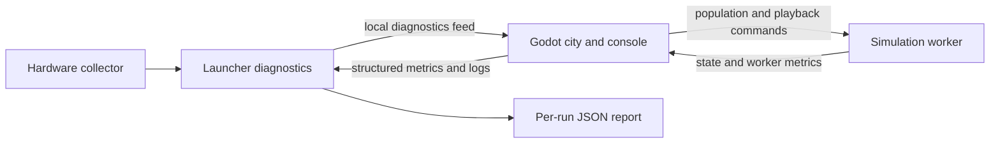

# Live population experiments and widescreen workspace

Status: implemented, September 6, 2026. The design below records the agreed scope.
The application now has a responsive Performance workspace, live roster changes,
and local telemetry. See the [application guide](../civic_center/README.md#desktop-workspace-and-live-experiments)
for controls and the [patch notes](PATCH_NOTES.md) for validation and measured limits.
Successful experimental counts do not establish interactive population capacity.

The user wants a wider desktop workspace, live additions and removals while the
current day continues, and performance charts, filterable logs, and action buttons.
A command prompt is outside this first delivery.

## Intended experience

Maximize SF-city or use fullscreen, then open **Performance**. Keep the city,
inspector, and diagnostics visible on a wide display. Enter a target population
or use **+100**, **+1,000**, **-100**, and **-1,000**, then apply the change.
Show current count, requested count, preparation status, and the committed result.

The day, playback speed, camera, and surviving citizens continue from their current
state. New citizens receive homes, jobs, and schedules. Population changes appear
on the performance timeline as explicit synthetic experiments.

Pause/resume, next activity, playback speed, 2D/3D view, and save/load remain
accessible. **Record point** captures an aggregate observation.
**Open run log** opens the local report. Clearing the console only clears its view.

## Starting point before this delivery

| Area | Current implementation | Required extension |
| --- | --- | --- |
| Window | [project.godot](../viewer/project.godot) starts at 1440 x 900 with canvas_items scaling. [hud.gd](../viewer/hud.gd) uses fixed-width panels. | Responsive layout, explicit aspect handling, display settings, and short-window scrolling. |
| Population | [scenario.py](../civic_center/scenario.py), [city_scenario.py](../civic_center/city_scenario.py), and the [worker](../civic_center/worker.py) use presets and prepare replacement scenarios. City runtime presets end at 1,000. | A separate operation that changes the active roster without restarting the day. |
| Larger counts | Offline city generation supports 2,000 and 5,000 with distinct assignments. | Validate live resizing separately; offline generation does not establish interactive capacity. |
| Viewer metrics | [main.gd](../viewer/main.gd) measures frame intervals, presentation phases, decoder queues, and render counts. Runtime log summaries emit about every ten seconds. | Live charts, fresh worker measurements, and experiment boundaries. |
| Hardware | [hardware_monitor.py](../civic_center/hardware_monitor.py) samples in a background thread; [run_log.py](../civic_center/run_log.py) retains recent history and lifetime summaries. | Publish a small live feed to Godot and retain per-experiment summaries. |
| Persistence | [checkpoint.py](../civic_center/checkpoint.py) reconstructs a fixed roster from the beginning of its schedule. | Restore runtime roster changes exactly in a new versioned mode. |

## 1. Wider screens and display settings

Support resizable, maximized, and fullscreen windows, with an F11 toggle. Restore
the last usable window size/mode and UI scale; clamp saved positions to an
available monitor. Keep preferences in local application data and expose launch
overrides for reproducible measurements.

Retain canvas_items scaling and explicitly expand the aspect ratio. Use anchored
containers, bounded panel widths, scrollable contents, and a compact layout when
space is limited. Godot documents aspect expansion and user-controlled UI scaling
in its [multiple-resolution guide](https://docs.godotengine.org/en/stable/tutorials/rendering/multiple_resolutions.html);
window modes are exposed by [DisplayServer](https://docs.godotengine.org/en/stable/classes/class_displayserver.html).

Offer UI scale choices of 100%, 125%, and 150%. Default diagnostics to a resizable
right panel on wide windows and a collapsible bottom drawer on narrower windows.
Keep the clock and population actions reachable without obscuring the whole city.

Centralize screen rectangles for panel placement, map framing, and input exclusion.
Audit fixed footer allowances in map_2d.gd, destination fitting, picking, panning,
and loading overlays. Numeric editors, dropdowns, search fields, and modal controls
must suppress city keyboard/mouse input while they own it.

Validate 1280 x 720, 1440 x 900, 1920 x 1080, 2560 x 1440, 3440 x 1440, and
5120 x 1440, including short windows and 125%/150% Windows scaling. Distinguish
offscreen layout checks from physical-display testing. Record actual rendered
resolution for performance measurements.

## 2. Add and remove citizens during the current day

Introduce a capability-advertised **set_population** command with an integer
target, request ID, expected roster revision, and expected session ID. Request IDs
are scoped to a client namespace, so reconnects and restores cannot reuse old commands. Keep the existing **population**
restart command compatible and clearly labeled. Apply explicitly; typing a
number must not immediately mutate the simulation.

Use one shared count validator. The initial experimental range is
1-5,000; expose only the ceiling validated against transport and checkpoint
limits. Exercise 200 -> 500 -> 1,000 -> 2,000 -> 5,000 progressively. Reject
unsupported requests with an explanation, without silently clamping or applying
only part of a requested change. This is a test bound, not a capacity promise.

### Model invariants

- Surviving citizens keep IDs, assignments, schedules, active trips, and travel
  progress. Preserve the clock, pause state, speed, and existing future events.
- Allocate never-reused IDs with a persistent monotonic counter. Derive synthetic
  attributes from the scenario seed and identity.
- Initially reuse eligible home/work pairs and prepared route geometry from the
  loaded scenario. Show unique assignment counts separately: more citizens using
  familiar routes increases load but does not increase geographic diversity.
- Initialize only the new cohort at the actual commit tick: home, work, or partway
  through a commute according to its schedules. Enqueue future transitions and
  record insertion now; do not invent earlier departure/arrival history.
- Remove newest additions first, then original residents in a stable documented
  order if necessary. This rule applies indoors and during trips. Describe the
  operation as experimental removal, not modeled death or relocation.
- Update roster/source records, occupancy, trips, templates, recurring indexes,
  and scheduled-event heap atomically. Removed residents must never reappear
  through pending events. Update synthetic capacity/allocation metadata and
  provenance without changing observed building or source dwelling/job values.
- A no-op target changes no cohort or transport session. Deduplicate request IDs
  and reject stale roster revisions. Disable mutation during read-only replays.

Use the existing isolated-job infrastructure for expensive preparation. Keep one
mutating operation pending; define save/load/reset/resize conflicts explicitly.
The current day continues while preparation runs. Pause, speed, reconnect, and
shutdown stay responsive.

Prepare a detached delta, not a replacement copy of the advancing city. At a
completed tick, catch the new cohort up to that tick, validate the candidate's
metadata, negotiated formats, route budgets, and checkpoint limits, then commit
once. Never overwrite surviving state with an older prepared snapshot.

Measure preparation and main-loop commit costs. Reuse immutable graph/route data
and avoid copying the entire city graph per adjustment. If bounded staging is
needed to keep commits responsive, implement it before raising the exposed limit.
Failure/cancellation before commit retains the old population and continuing day.
After commitment, reconnect a lost client with a fresh bootstrap rather than
rolling back a change already acknowledged to other clients.

### Transport and viewer handoff

Reuse the reliable new scene/session barrier, adding
reason=population_adjustment and checking unchanged static-world identity.
The transport session changes to invalidate stale decoded metadata; the
authoritative day continues. Send the new roster, acknowledgment with committed
tick/count/revision, required route definitions, and complete matching snapshot
in reliable order.

Retain the previous coherent presentation until the first new snapshot is usable,
then switch membership and occupancy together. Preserve static 2D geometry,
3D scenery, camera mode/pose/zoom, follow offsets, and a surviving selection.
Rebuild population-dependent inspector and area-activity indexes.

When a followed person is removed, detach at the actual camera pose and clear
the target. Suppress the existing automatic selection of another person and
the fallback to an older orbit position.

Update the [protocol](../contracts/CIVIC_PROTOCOL.md), compact decoders, shared-route
bootstrap, reconnect handling, and fixtures. Preserve the independent limits:
16 MiB frames, bounded outbound/route caches, 192 MiB isolated-job transfers,
and checkpoint/container limits. Route metadata retransmission is a remaining
transition cost to measure, not an avoided cost.

### Save, load, and reset

Ship checkpoint version 3 or a new explicitly versioned restore mode with live
resizing. Store current roster, ID allocator, insertion metadata, roster revision,
tick/pause/speed, resident activity/building/cycle/heading, active-trip identity
and timing, exact next transitions, occupancy, event count, and bounded history.

Restore validated domain records; reconstruct routes from the saved graph and
verify geometry hashes and queue/state consistency. Preserve checksums, size
budgets, atomic writes, and reads of v1/v2 saves. Tie prepared checkpoint data
to the roster revision: the existing model weak reference alone cannot detect
an in-place roster change. Avoid an unbounded mutation journal or serialized
executable Python objects.

Reset day explicitly restarts the current roster's seeded schedules. Live resizing
never invokes reset. A restored save must continue resizing without ID collisions.
Failed saves retain the prior save.

## 3. Live performance console

Use a separate authenticated, bounded loopback feed owned by the launcher.
Pass its endpoint and credential in the initial viewer options so loading
diagnostics work too. Reuse the existing hardware collector.

Version messages with run ID, sequence, source, kind, timestamp, and drop counts.
Send inventory/latest readings plus a small recent-log window on connection.
Bound event count and byte queues; coalesce hardware readings for slow viewers.
Keep network work outside logger locks and collector calls.

Publish sanitized in-memory updates instead of repeatedly parsing the growing
JSON report. Tee bounded launcher/viewer, worker, and preparation diagnostics
while retaining archival capture. Worker stdout currently has a readiness-only
reader: do not add periodic stdout output without continuously draining it.
Preserve source and severity semantics, including nonfatal Godot warnings.

Draw viewer frame charts from local measurements. Never print received diagnostics
back into the captured output stream. Buttons use the existing worker command
channel; the observation feed does not execute simulation commands.

Hardware refresh follows its configured interval, normally one second. Refresh
numeric UI at no more than 5 Hz and charts around 1 Hz. Show timestamps, sample
age, warm-up, unsupported sensors, dropped entries, and disconnected/stale feeds.
Direct Godot launches and disabled monitoring still expose local viewer metrics.

| Section | Readings and controls |
| --- | --- |
| Frames | Callback interval, p50/p95/p99, derived frame rate, draw calls/primitives, visible/animated residents, presentation and decode costs. These are callback/CPU measurements, not GPU execution timings. |
| Simulation | Total/home/work/traveling/blocked residents, virtual ticks advanced, simulated seconds per wall second, requested speed, advance cost, snapshot frequency/bytes, and command latency. |
| Hardware | System CPU/RAM, launcher/viewer/worker/preparation CPU and memory, available NVIDIA GPU/VRAM/temperature/power, and disk activity. Separate machine-wide from process measurements. |
| Transport | Snapshot age, encode/decode/expansion costs, route-cache use, queue occupancy/coalescing, connection state, and population handoff latency. |
| Logs | Timestamp, severity/source filters, text search, pause auto-scroll, bounded rows, clear visible entries, and open run report. |
| Actions | Apply target population, add/remove steps, pause/resume, speed, next activity, 2D/3D, save/load, and record comparison point. |

Instrument worker advancement and snapshot publication explicitly. Virtual ticks
are event-driven simulation progress, not equally expensive CPU updates. Do not
infer publication count from sequence numbers that can increment separately for
different encodings. Show achieved and requested speed together; paused periods,
explicit steps, time jumps, and population transitions have separate labels.

Bound chart/log history and stop hidden-panel redraw/layout work. Preserve
current units and availability: GPU readings cover the adapter, some sensors
are unsupported, and process CPU can exceed 100% across logical cores.

## 4. Measurements and product impact

Add bounded experiment phases to the JSON log. Record requested/committed
population, roster revision, committed tick, operation outcome, preparation,
commit and handoff durations, and aggregate metrics. Use the authoritative commit
as the population phase boundary, confirmed through acknowledgment or reconnect.
A delayed acknowledgment must not shift that boundary. Record request, commit,
receipt, and presentation handoff separately, with the same roster revision.

Align launcher, worker, and viewer timestamps to a documented run-relative time
base through a measured handshake; retain local timestamps and synchronization
uncertainty. Samples that cannot be assigned confidently remain mixed or unknown.

Split phases on changes to view, resolution, pause, speed, or cohort. Reset or
partition rolling frame/phase windows so a new condition's p95 does not include
the preceding workload. Mark transition/settling periods and hardware intervals
spanning boundaries as mixed. Retain whole-run peaks, exact sample counts, and
truncation indicators. Do not silently combine stale ten-second viewer context
with new population data.

Comparison points include active-trip counts, camera/location, pixel resolution,
UI scale, renderer, vsync/frame cap, scenery/cache state, seed/world fingerprints,
hardware, sampling configuration, and measurement duration.

Live adjustments are exploratory because the time and workload keep changing.
Controlled comparisons use the same saved state and settings. Use at least three
paired console-visible/hidden runs with hardware sampling constant to measure
console overhead. Measure monitoring on/off separately if assessing total
diagnostics overhead. Keep loading, transitions, and settled frames separate.
Do not sum overlapping CPU phases or treat averaged percentiles as raw samples.

Report action-to-commit time, handoff latency, frame p95, achieved simulation speed,
process memory, and available GPU metrics at each tested count. Report units and
absolute/percentage differences only for comparable conditions. Wider windows
may add graphics work; record resolution separately from population effects.

After delivery, update the application guide and root README and add patch notes
with measured benefits, commands, scenarios, sample counts, and limitations.
Store a small aggregate artifact in docs/benchmarks/ and keep raw logs/settings/
screenshots in ignored local directories. Existing ignore rules cover those paths.
No optimization percentage or maximum usable population is claimed in this plan.

## Delivery order and completion gates

| Stage | Deliverable | Complete when |
| --- | --- | --- |
| 1 | Responsive workspace, display preferences, console shell. | Controls remain reachable at target sizes; fullscreen/restore, map picking, and input exclusion work. |
| 2 | Live feed, worker metrics, charts, filtered logs, comparison markers. | Failures stay nonfatal; freshness is explicit; slow clients, floods, and hidden panels remain bounded. |
| 3 | Live roster delta, custom controls, checkpoint v3, transport handoff. | Running/paused additions and removals preserve survivor state; saves restore exactly and support further changes. |
| 4 | Progressive population trials, diagnostics-overhead measurement, evidence and notes. | Tested limits and observed costs are documented without extrapolating to San Francisco's real population. |

Required regressions: departure/arrival boundaries, midnight/repeating days,
indoor/moving/blocked/followed removals, repeated grow/shrink cycles, ID uniqueness,
occupancy conservation, no ghost scheduled events, exact survivor parity against
an unchanged control simulation, valid routes, failure/cancellation before commit,
conflicting requests, stale frames, fragmented bootstraps, reconnect, and exact
save/load continuation after multiple mutations.

Diagnostics checks cover redaction, no echo loop, slow/disconnected clients,
log floods, failed population commands, and mixed-interval phase attribution.
Run applicable Python and Godot checks during implementation. Capture rendered
layout evidence in map and 3D. Repeated population cycles should expose retained
resident/route buffers; account for warmed caches and noise. Validate packaging
for new modules and startup options.

Deferred: automatic ramps, arbitrary command input, zero-resident scenarios,
new geographic assignment distributions, and higher population ceilings after
profiling. The first release includes genuine live changes and compatible saves.

## Delivered validation and remaining measurements

The delivered implementation passed the application suite (802 passed, 1 skipped)
and the relevant Godot UI, input, transport, telemetry, map and presentation checks.
Rendered probes exercise paused and running changes, exact survivor state,
occupancy, follow-target removal, and save/load followed by another resize.
A fresh pilot package also passed these flows with its bundled runtimes.

Layout checks cover the requested sizes above, actual UI scale changes, and
windowed/maximized/fullscreen transitions. Requested geometry and actual rendered
window dimensions are recorded separately. These checks do not establish behavior
on physical 3440/5120-pixel ultrawide displays or across monitors with different
Windows DPI.

The final [measurement summary](benchmarks/2026-09-06-live-workspace.json) records
short, paired console-visible/hidden observations at a paused state, with hardware
sampling enabled in both conditions. These characterize the delivered console;
they do not measure a before/after runtime optimization or sustained unpaused
simulation throughput. The [patch notes](PATCH_NOTES.md) report the explored counts,
population-change delays, route-data rejection and measurement limits.

Automatic ramps, monitoring-on/off comparisons, long-duration memory/throughput
trials, and physical multi-monitor validation remain future work.
