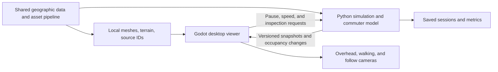

# Renderer investigation for the City Hall simulation

**Decision, September 5, 2026: the user selected Godot after trying the demos.**
The comparison below is the research record, including the earlier shortlist and
conditional recommendations. Current work follows the
[Godot implementation plan](GODOT_NEXT_STEPS.md); this choice is not a benchmark ranking.

Research date: September 5, 2026. Three parallel agent investigations covered desktop engines, geospatial renderers, and web 3D engines. The primary agent checked additional tools and reconciled the findings against the [San Francisco plan](SAN_FRANCISCO_PLAN.md). The research below preceded implementation. There are now [six runnable City Hall demos](../comparison/README.md) for hands-on comparison; their functional checks are not a controlled performance benchmark.

**Research recommendation, before selection.** Shortlist **Godot plus the existing Python simulation** and **Panda3D** for the desktop pilot. Godot is the preferred product direction for the requested game-style experience, especially repeated work on the City Hall landmark, materials, nearby characters, walking, and inspection UI. Panda3D remains the simplest integration when staying entirely in Python is the priority. This revises the earlier Panda3D-only baseline into a provisional choice that the first scene should test.

Among web options, Babylon.js is the strongest game-oriented alternative in this review; Three.js provides flexible control over a custom visualization; deck.gl excels at geographic data layers and can complement either a web scene or a separate analysis view. CesiumJS becomes particularly attractive when streaming real geographic surroundings matters more than game authoring. These are judgments about fit and implementation effort, not measured speed rankings.

**What we are choosing for.** The confirmed product is a desktop 3D explorer around City Hall and Civic Center, with overhead and ground-level views, selectable persistent residents, homes and workplaces, daily commutes, real-data geography, and expansion beyond the pilot. A first-person camera, a walkable scene, a commuting simulation, and accurate geographic content are distinct requirements. No renderer provides all four merely by displaying a city model.

| Tool | Best role here | Main advantage | Main work remaining |
|---|---|---|---|
| **Godot + Python** | Preferred desktop game viewer | Integrated scene editor, materials, animation, UI, and character movement facilities | Python worker and message protocol; geographic preprocessing; camera rigs and simulation-specific UI |
| **Panda3D** | Direct Python desktop application | Existing engine can run in the same application process | More scene/UI authoring in code; additional glTF/PBR pipeline components; geographic preprocessing |
| **deck.gl + MapLibre** | Geographic inspection and commute visualization | Geographic layers, picking, extruded buildings, paths, tiled content, and map composition | Walking/character systems, live Python synchronization, desktop wrapper |
| **Three.js** | Custom 3D visualization with web UI | Flexible rendering, glTF assets, custom materials, and geographic integrations | Collision controller, game structure, Python transport, desktop wrapper |
| **Babylon.js** | Web technology alternative for game-like exploration | Integrated camera options, simple camera collision, animation, and game-oriented facilities | Geographic pipeline or tile integration, Python transport, desktop wrapper |
| **CesiumJS** | Geographic streaming and surrounding-city context | Terrain, georeferencing, 3D Tiles, moving objects, and camera surface collision | Character movement and detailed street interactions; simulation integration and wrapper |
| **Unreal/Unity + Cesium** | Larger production emphasizing geographic immersion | Game engine plus an established Cesium geographic integration | Larger toolchain, Python runtime integration, content preparation, applicable engine terms |
| **Ursina** | Rapid Python camera/interaction prototype | Panda3D-based convenience API and prefabricated controllers | Same underlying geographic/content problems; dependency compatibility and packaging validation |

The capability evidence and limitations behind these judgments follow.

**Panda3D versus Godot.** Panda3D offers a direct Python interface and tools for building self-contained executables. That reduces communication and debugging work in this repository. Its official glTF documentation recommends the third-party `panda3d-gltf` importer and explains that physically based materials require custom shaders or an add-on such as `panda3d-simplepbr`. A usable modern asset pipeline is possible, but it is additional integration work. [Panda3D introduction](https://docs.panda3d.org/1.10/python/introduction/index), [glTF pipeline](https://docs.panda3d.org/1.10/python/pipeline/gltf-files), [packaging](https://docs.panda3d.org/1.10/python/distribution/building-binaries).

Godot brings the editor, scene organization, 3D asset import, material/lighting tools, animation, and UI into one workflow. Its `CharacterBody3D` supports controlled movement against walls and slopes; camera placement, transitions, collision geometry, and input still need implementation. My inference is that these facilities address more of the repeated work in the finished City Hall application than direct Python integration alone. [Godot features](https://docs.godotengine.org/en/stable/about/list_of_features.html), [3D importing](https://docs.godotengine.org/en/stable/tutorials/assets_pipeline/importing_3d_scenes/index.html), [CharacterBody3D](https://docs.godotengine.org/en/stable/classes/class_characterbody3d.html).

Godot does not officially support Python as a scripting language. The proposed design is a GDScript viewer and a packaged Python worker communicating locally, rather than depending on unofficial Python bindings. A versioned snapshot protocol, launcher, readiness checks, and shutdown handling are real costs. They also create an explicit boundary between the model and its presentation. [Godot FAQ](https://docs.godotengine.org/en/stable/about/faq.html), [WebSockets](https://docs.godotengine.org/en/stable/tutorials/networking/websocket.html).

Neither reviewed core engine supplies a complete GIS-to-city or 3D Tiles workflow. Prepare projected terrain/building meshes and geographic metadata in the shared data pipeline. Panda3D has heightfield terrain renderers; Godot can use generated geometry or a separately evaluated terrain add-on. [Panda3D terrain](https://docs.panda3d.org/1.10/python/programming/terrain/index), [Terrain3D import workflow](https://terrain3d.readthedocs.io/en/stable/docs/heightmaps.html).

**deck.gl is a substantial 3D option.** It supports first-person views, terrain, tiled 3D content, and instanced glTF scenes. `TripsLayer` can animate timestamped routes, while `ScenegraphLayer` provides object transforms, picking, and animation options. These are useful for showing commuters and understanding flows. They do not create resident schedules, choose routes, or implement a collision-aware pedestrian controller. [FirstPersonView](https://deck.gl/docs/api-reference/core/first-person-view), [Tile3DLayer](https://deck.gl/docs/api-reference/geo-layers/tile-3d-layer), [ScenegraphLayer](https://deck.gl/docs/api-reference/mesh-layers/scenegraph-layer), [TripsLayer](https://deck.gl/docs/api-reference/geo-layers/trips-layer).

MapLibre adds basemap styling, labels, and map navigation. Its interleaved deck.gl integration shares a WebGL2 context, allowing correct depth relationships between geographic objects and data layers. Separate overlaid canvases do not automatically share depth. A hybrid also needs an explicit owner for the camera, coordinate transforms, picking, and update lifecycle. [deck.gl and MapLibre](https://deck.gl/docs/developer-guide/base-maps/using-with-maplibre).

Use WebGL2 as the initial compatibility baseline for this hybrid. The live deck.gl WebGPU documentation still labels support as a work in progress and not production ready. Its current table lists implementations for many proposed layers, including Scenegraph, Trips, Terrain, and Tile3D, while base-map interleaving and other features remain limited. Search snapshots disagreed about individual layer availability during this review: pin a release and test the exact feature combination instead of assuming either universal support or universal absence. [deck.gl WebGPU status](https://deck.gl/docs/developer-guide/webgpu).

**pydeck is not a shortcut to the live application.** It is valuable for Python exploration and exported views. Its current Jupyter documentation states that widget updates, selection, and binary transport are not functional in v0.9+, despite older examples showing these features. The homepage also describes an internet-dependent default setup. A production viewer should own its JavaScript dependencies and explicit Python communication, and verify offline operation. This limitation concerns the documented pydeck widget path, not deck.gl's ability to receive live data in a custom JavaScript application. [pydeck Jupyter limitations](https://deckgl.readthedocs.io/en/latest/jupyter.html), [pydeck overview](https://deckgl.readthedocs.io/en/latest/).

**Three.js versus Babylon.js.** Three.js is deliberately focused on rendering; its own game manual explains that the application supplies additional game systems. Orbit and pointer-lock controls are useful starting points, but look/movement controls alone do not prevent walking through a building. It supports glTF scene and animation loading and gives considerable freedom for a custom scene with an HTML inspector. [Three.js game manual](https://threejs.org/manual/en/game.html), [GLTFLoader](https://threejs.org/docs/pages/GLTFLoader.html).

Babylon.js includes camera choices for orbit, first-person, and follow behavior and a simple camera collision/gravity system. This shortens the route to a basic walkable environment. More realistic physical interactions use a physics integration; the documented simple camera gravity is not an authoritative commuter model. On this evidence, Babylon deserves a higher position than Three.js when selecting a web engine specifically for game-like exploration. [Babylon camera options](https://doc.babylonjs.com/features/featuresDeepDive/cameras/camera_introduction), [camera collisions](https://github.com/BabylonJS/Documentation/blob/master/content/features/featuresDeepDive/cameras/camera_collisions.md).

Both now have a documented integration with NASA-AMMOS's `3d-tiles-renderer`. That adds geographic tile loading to either engine; it is a separate library and does not create trustworthy building identities, entrances, or sidewalk connectivity. For a small offline pilot, prepared local meshes remain a straightforward alternative to streaming. [3D Tiles Renderer](https://github.com/NASA-AMMOS/3DTilesRendererJS).

**Cesium and other options.** CesiumJS is the strongest geographic specialist in this comparison. Its official quickstart demonstrates terrain and buildings in San Francisco. Current camera collision controls can prevent movement through a tileset surface, so it should receive credit for more than a free-flying camera. Character locomotion, pedestrian avoidance, animation behavior, and detailed ground interactions still need separate systems. [CesiumJS quickstart](https://cesium.com/learn/cesiumjs-learn/cesiumjs-quickstart/), [camera collision](https://cesium.com/learn/cesiumjs/ref-doc/ScreenSpaceCameraController.html).

Cesium Native is a C++ component for selecting/loading geographic tiles; it does not render them. Connecting it directly to Panda3D would require an adapter for rendering resources and their lifecycle. Existing Cesium integrations for Unreal and Unity avoid building that entire bridge. Both engines' documented Python scripting facilities are for their editors, not a way to run this Python simulation inside a shipped game. A retained Python runtime would still need separate integration. [Cesium Native integration](https://cesium.com/learn/cesium-native/ref-doc/rendering-3d-tiles.html), [Cesium for Unity](https://cesium.com/learn/unity/), [Unreal Python boundary](https://dev.epicgames.com/documentation/en-us/unreal-engine/scripting-the-unreal-editor-using-python), [Unity Python boundary](https://docs.unity3d.com/Packages/com.unity.scripting.python@7.0/manual/index.html).

Ursina wraps Panda3D and includes first-person and editor-camera prefabs. It could shorten a small interaction proof; it does not remove geographic preprocessing or establish production crowd capacity. Its current homepage requires Python 3.12+, while this repository advertises Python 3.10+, so adopting it would require an explicit compatibility decision. [Ursina](https://www.ursinaengine.org/), [relationship to Panda3D](https://www.ursinaengine.org/faq.html).

**Desktop packaging and offline data.** A JavaScript viewer can still run in a desktop game window. The alternatives have different integration costs:

| Wrapper | Practical consequence |
|---|---|
| [pywebview](https://pywebview.flowrl.com/guide/architecture.html) | Python host with a JavaScript bridge and locally served assets. Attractive for this repository; verify the installed web engine's rendering support and message throughput. |
| [Electron](https://www.electronjs.org/docs/latest/) | Ships Chromium and Node.js, providing a controlled browser runtime alongside the application. The Python worker still needs packaging and lifecycle management. |
| [Tauri](https://tauri.app/develop/sidecar/) | Supports bundled sidecar executables, including packaged Python. Its system webview and native/Rust build requirements add platform-specific checks. [Prerequisites](https://tauri.app/start/prerequisites/). |

Local code, terrain, meshes, textures, and decoders can support offline web-based applications. Cesium documents replacing its default external dependencies, and its engine integrations can load suitable local tilesets. An open renderer does not grant permission to redistribute every hosted tile service; evaluate the chosen data independently. No detailed, redistributable City Hall photogrammetry dataset was established by this renderer review. [Cesium offline guide](https://github.com/CesiumGS/cesium/blob/main/Documentation/OfflineGuide/README.md), [local Cesium datasets](https://cesium.com/learn/unity/unity-datasets/).

Engine and content costs should remain separate. Panda3D and Godot use permissive open-source licenses; proprietary engines have application-dependent terms, while plugins, assets, and hosted geography may have their own costs. The pilot does not require purchasing hosted content. [Panda3D license](https://www.panda3d.org/license/), [Godot licensing](https://docs.godotengine.org/en/stable/about/complying_with_licenses.html), [Unreal terms](https://www.unrealengine.com/eula/unreal), [Unity Personal eligibility](https://unity.com/products/unity-personal).

**Performance evidence needed.** None of these tools makes 5,000 independently animated residents a demonstrated capability for this project. Instanced geometry, independent skeletal animation, simulation updates, pathfinding, and transport between processes have different costs. Panda3D scene-graph instancing is not automatic draw-call batching; Godot MultiMesh culls groups rather than individual instances; Three.js InstancedMesh reduces repeated-geometry draw calls but is not a turnkey independently animated skeletal crowd. Babylon's baked vertex animation supplies another crowd option, with baking, memory, and animation constraints. [Panda3D instancing](https://docs.panda3d.org/1.10/python/programming/scene-graph/instancing), [Godot MultiMesh](https://docs.godotengine.org/en/stable/tutorials/performance/using_multimesh.html), [Three.js InstancedMesh](https://threejs.org/docs/pages/InstancedMesh.html), [Babylon baked animation](https://github.com/BabylonJS/Documentation/blob/master/content/features/featuresDeepDive/animation/baked_texture_animations.md).

A renderer's visible tiles must not determine whether residents exist, have valid routes, or remain grounded in the simulation. Streamed visual geometry can disappear outside the camera view. Keep the authoritative street graph and resident state independent, and define which collision surfaces must remain available for ground exploration. Cesium's game-engine documentation illustrates the consequences of tile culling for physics. [Cesium object placement](https://cesium.com/learn/unreal/unreal-placing-objects/).

**Proposed architecture for the preferred candidate.**

Keep static geometry separate from frequent resident updates. A render snapshot needs simulation time, stable resident/building IDs, positions, headings, activities, and relevant occupancy changes. The viewer interpolates positions and owns camera interaction; Python owns scheduling, trips, arrival, and saved model state. Local selection/follow changes need not round-trip through the simulation. Batch updates and measure serialization/transport rather than sending every engine tick or rebuilding the whole scene every frame. The same data contract can also serve Panda3D directly or a future analysis viewer.

**Earlier decision experiment.** Compare Godot and Panda3D first using identical inputs: City Hall plus nearby blocks, terrain, one landmark asset, one animated pedestrian asset, a fixed camera route, and recorded resident snapshots. If geographic preparation is the dominant bottleneck, add a narrowly scoped CesiumJS comparison. Avoid building every candidate into a full application.

| Check | Evidence to collect |
|---|---|
| Geographic alignment | Matching road/building/terrain positions and known reference points; tagged height estimates |
| Street exploration | Overhead-to-ground transition, wall/slope collision, picking, and following a resident |
| Asset authoring | Correct landmark materials, character animation, and effort required for a typical visual change |
| Independent rendering cost | Same visible geometry, resolution, animation detail, and camera route on the same hardware |
| Simulation integration | Snapshot throughput, timing, pause/speed behavior, and unchanged results when moving the camera |
| Population workloads | Separate 100/1,000/5,000 simulated-resident tests from the number of detailed visible characters |
| Distribution | Packaged startup, worker readiness/shutdown, offline assets, and memory over a long session |

Choose Godot if its authoring and exploration benefits outweigh the measured bridge/distribution work. Choose Panda3D if direct Python integration gives a simpler complete product and the asset/interaction workflow meets the visual target. Keep deck.gl as a candidate for a later analysis view, and choose a web-based main viewer if its data/UI advantages prove more valuable than native game authoring. The investigation supports this shortlist; it does not establish a benchmark winner.
