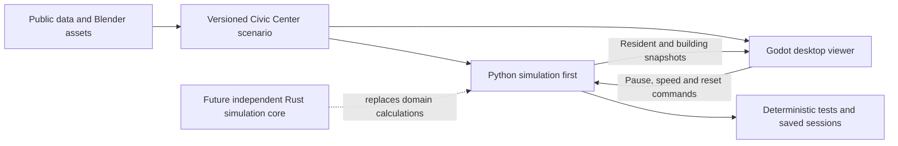
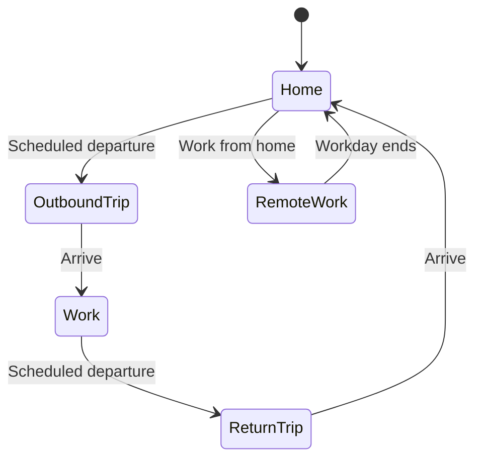

# San Francisco living-city simulation plan

Planning baseline: September 5, 2026; scope expanded September 6 to the actual extent of San Francisco. Godot is selected. The dedicated application now has persistent residents, a live Python worker, inspection and save/resume. Official citywide geographic imports and terrain have been prepared; their first integrated city scenario is being validated. See [current implementation evidence](OVERNIGHT_PROGRESS.md), [launch instructions](../civic_center/README.md), and the [Godot implementation plan](GODOT_NEXT_STEPS.md). The six renderer demos remain in [comparison](../comparison/README.md).

**The application.** Build a desktop 3D living-city explorer spanning San Francisco, with City Hall as the starting location and a focus for architectural detail. Users can orbit above the city, explore at ground level, select buildings, and follow residents through their home, work, and commute routines. Geography and aggregate behavior should match available real-world data as closely as practical.

**Confirmed requirements.** Exploration and inspection, real-data accuracy, residents with homes and jobs, a desktop game window, overhead and ground-level views, City Hall as the starting location, and expansion to the actual size of San Francisco. The earlier neighborhood pilot is an implementation stage, not the final geographic boundary.

**Current scope defaults.** Prepare the complete available street/building layers and the mainland/island shoreline, then load detailed geometry near the camera in spatial tiles. Use an ordinary weekday and building exteriors. Begin with a spatially distributed synthetic commuting cohort on the real network; population calibration and citywide capacity are measured separately from map extent. Give City Hall a recognizable dome and facade aligned to its observed footprint. Precise photorealistic facades and accessible interiors remain future work.

The first satisfying experience is: open the application above City Hall, start the morning simulation, select a traveler, see their home and workplace, follow their trip, switch to ground level, and watch them arrive. A resident who lives or works outside the detailed area must still have a coherent trip.

**Technical direction, selected after the demos.** Godot is the chosen desktop engine. Reuse the Blender asset, overhead/walk/follow cameras, selection and instanced characters from `comparison/godot/` in a dedicated `viewer/` application. The other demos remain reference implementations. Continue with the tested Compatibility renderer initially; graphics quality experiments follow an integrated simulation baseline.

The planning default is to connect the existing Python engine first and adopt Rust incrementally. The user has selected Godot and expressed interest in Rust; a full rewrite has not been requested. Keep domain records independent of Python object references and Godot scene nodes so Rust can later own the same simulation behavior. The [next-step plan](GODOT_NEXT_STEPS.md) records this assumption and a concrete migration path.

Python initially owns the clock, residents, trips, occupancy and saved state. Godot owns rendering, interpolation, input and inspection. Selection and follow stay local to the viewer; pause, speed and reset go to the authoritative simulation. Introduce persistent resident records separately from the current disposable resource carriers. Explicit simulation steps must report completed ticks and account for time still pending behind the existing update-loop cap during accelerated playback.

The first transport is planned as local TCP with versioned, framed JSON batches, using Python's standard library and Godot's `StreamPeerTCP`. Keep transport separate from the domain model and viewer snapshot application. A future Rust GDExtension can supply equivalent batches inside Godot without retaining a Python process for migrated functionality. Pin and test the Godot/Rust binding pair before adoption; Rust integration remains to be built. [Godot TCP interface](https://docs.godotengine.org/en/stable/classes/class_streampeertcp.html), [godot-rust integration](https://godot-rust.github.io/book/intro/hello-world.html), [binding compatibility](https://godot-rust.github.io/book/toolchain/compatibility.html).

**What this repository contributes.** Source inspection found a reusable fixed-timestep simulation, arbitrary road graphs, buildings, resources, configurable rules, and moving resource carriers. The San Francisco scenario needs more than a new DSL file: the current layout is constructed in Python and the agents do not represent persistent residents.

| Current component | Planned use or necessary change |
|---|---|
| `openglassbox/simulation.py`, `city.py` | Reuse simulation coordination; add an explicit scenario clock and connect scheduled resident activity. |
| `openglassbox/path.py`, `dijkstra.py` | Reuse graph concepts; extend routing for direction, travel time, access mode, entrance connectors, and cached complete trips. |
| `openglassbox/agent.py` | Keep resource-carrier behavior available; add persistent resident and trip state separately. Current carriers disappear after unloading. |
| `openglassbox/unit.py`, rule system and DSL | Reuse buildings and resource rules where useful; load geographic instances from a scenario data format. |
| `demo/src/city_setup.py`, `main.py` | Use as integration references. Create a separate Civic Center entry point with configurable scenario loading. |
| `demo/src/ui_renderer/` | Reuse inspection concepts; implement 3D picking, camera controls, and a readable inspector in the new viewer. |
| `demo/src/session_recorder.py` | Use as a reference for events; design bounded recordings and save/load with resident, clock, and random-generator state. |

There is no demonstrated full-city capacity. Current routing repeats searches along a trip, the renderer visits every entity, and the existing pathfinding performance benchmark contains a placeholder operation. Benchmark real routes and representative populations before promising a scale target. Also normalize map spacing: the current 2D map renderer and engine use different coordinate scales.

**Data foundation.** The source inventory below includes later calibration and transport work. Current imports cover DataSF streets, 2010-derived footprints, shoreline/islands and a USGS 3DEP floating-point terrain grid. Observation periods remain separate from portal refresh dates; generated home/work assignments do not represent observed individuals.

| Input | Source and intended use | Accuracy boundary |
|---|---|---|
| Street network | [SF Streets - Active and Retired](https://catalog.data.gov/dataset/streets-active-and-retired): street centerlines and network IDs. | Filter active streets; verify direction and mode restrictions. Centerlines alone do not supply complete sidewalk, crossing, or lane geometry. |
| Building geometry | [SF Building Footprints](https://catalog.data.gov/dataset/building-footprints-04ba1): measured footprint shapes. | Metadata traces the geometry to a 2010 3D model. A recent portal update does not establish recent measurements. Verify available height fields; use tagged estimates where missing. |
| Building use and capacity | [Current SF Land Use](https://catalog.data.gov/dataset/san-francisco-land-use): parcel uses, housing units, and commercial areas for home/job allocation. | Some records group parcels. Validate joins to avoid duplicated buildings or capacities; current land use replaces archived annual versions. |
| Terrain | [USGS San Francisco elevation model](https://www.usgs.gov/special-topics/coastal-national-elevation-database-applications-project/science/topobathymetric-0): an available elevation baseline. | The documented 2 m product combines observations through 2010. Check for newer local coverage before selecting the import. Match vertical datums and distinguish roof elevation from building height. |
| Population and households | [Census ACS 2024 release](https://www.census.gov/programs-surveys/acs/news/data-releases/2024/release.html): five-year tract/block-group estimates. | The 2020-2024 estimates pool multiple years. Preserve margins of error and crosswalk census boundaries to the pilot area. |
| Home/work flows | [Census LODES overview](https://lehd.ces.census.gov/doc/help/onthemap/OnTheMapDataOverview.pdf) and [file specification](https://lehd.ces.census.gov/data/lodes/LODES8/LODESTechDoc8.0.pdf): block-to-block employment relationships. | The reviewed overview lists data through 2023. These are partially synthetic job relationships, not observed daily trips, building assignments, routes, or departure times. Verify the selected California files and their vintage. |
| Transit service | [SFMTA GTFS](https://www.sfmta.com/reports/gtfs-transit-data): stops and scheduled service for a transit commute phase. | Scheduled service is not live vehicle activity. Record feed service dates and applicable attribution/redistribution terms. |
| Travel patterns | [MTC Bay Area Travel Study](https://mtc.ca.gov/bay-area-travel-study): public regional summaries to inform departure times and transport choices. | Public summaries do not describe every Civic Center resident. Restricted research microdata is not a dependency. |

Each imported dataset needs a manifest with source URL, observation period, retrieval date, version or checksum, geographic coverage, coordinate system, attribution, and transformations. Each derived value should retain whether it was measured, inferred, or generated. Show useful source dates and estimates in the inspector's data details.

Use a local coordinate origin near City Hall and meters throughout routing, terrain, and rendering. Preserve source coordinates and stable geographic IDs for future imports. Keep building footprints, parcel records, entrances, road junctions, sidewalks, and transit stops as distinct entities. Generated entrance and sidewalk connectors should be tagged as approximations until better data is available.

**Resident behavior.** Create stable synthetic households and residents fitted to aggregate data. Each resident has a home, employment or nonworking status, an optional workplace, a daily schedule, a transport choice, and a current activity. Keep residence identity after a trip ends. Building occupancy changes as people enter and leave; a trip is temporary movement owned by a persistent resident.

Account for inbound workers, outbound residents, nonworkers, and remote work. A LODES job should not automatically produce one physical commute every day. Represent outside destinations with regional zones and boundary entry/exit connections, retaining outside travel time and resident identity. This allows a detailed City Hall scene without inventing a self-contained local economy.

Build a single walking trip first to prove the full loop. Then add directional road travel and timetable-based Muni trips, with appropriate walking connections and waiting time. Other modes can follow the selected area's measured demand. Initial car travel should use explicit free-flow assumptions; queues, intersection delays, and congestion need additional behavior and validation. A route animation alone does not demonstrate traffic accuracy.

Fit household and workplace totals to the selected sources; assess modeled commuting patterns against available mode, departure-time, and travel-time distributions. Record assumptions and discrepancies. Matching aggregate inputs does not validate an individual resident's path or make a current-day prediction.

**3D experience.** Provide orbit/pan/zoom, a ground-level walking camera with terrain and building collision, and a follow camera for selected residents. Use a shared selection model across both views. Show simulation time, pause/speed controls, a small location map, and a building/resident inspector. Useful overlays include homes, workplaces, active routes, building occupancy, and trip durations.

Generate terrain and surrounding building masses from the imported scenario. Build City Hall as a separate recognizable landmark asset, using documented references and appropriately licensed or original geometry. Do not assume an open, detailed landmark model already exists. Add entrances, sidewalks, crossings, vegetation, lighting, and facade variation in stages. Match geometry and scale before spending effort on decorative detail.

Partition geometry into small spatial chunks, simplify distant buildings, and display detailed characters only nearby. Resident simulation continues when the camera looks away. Use simple representations at a distance, and measure actual rendering cost: Panda3D scene-graph instancing does not automatically combine all visible instances into one draw call, while Godot MultiMesh culls groups rather than individual instances. Neither establishes detailed animated-crowd capacity without measurement. [Panda3D instancing](https://docs.panda3d.org/1.10/python/programming/scene-graph/instancing), [Godot MultiMesh](https://docs.godotengine.org/en/stable/tutorials/performance/using_multimesh.html).

**Implementation sequence and completion criteria.**

The engine decision is complete. Persistent commuting, Python integration and deterministic saves now have behavioral tests. Real-data city integration and scale are the active milestones; detailed skeletal animation remains later presentation work.

| Milestone | Deliverable | Complete when |
|---|---|---|
| 1. Godot application foundation | Dedicated viewer, packaged local assets, simulation adapter, stable IDs and one launcher. | A recorded snapshot drives drawing, picking and following; the viewer loads from a fresh checkout and reports connection failures clearly. |
| 2. One complete resident day | A persistent resident travels home-to-work-to-home under the authoritative clock, followed by a small seeded cohort. | Arrival stops movement, occupancy changes exactly once, IDs persist, pause/speed/reset agree, and frame rate does not affect outcomes. |
| 3. Real City Hall block | Reproducible street/building subset, entrances, collision, terrain baseline and source manifests. | Known reference points align in meters; measured and generated values are distinguished; routes connect actual pilot entrances. |
| 4. Neighborhood behavior and inspection | Start at 200 scheduled residents, explain homes/jobs/trips, represent outside destinations, and save/resume sessions. | Population/occupancy totals reconcile, unreachable trips are surfaced, and saved runs continue deterministically. Road/transit modes follow validated walking behavior. |
| 5. Rust adoption and measured scale | Validate a Rust extension, migrate a bounded domain component, and profile 200/1,000/5,000 workloads. | Python/Rust behavioral fixtures agree, packaged extension loading works, and measured costs justify each optimization. |
| 6. Visual quality and distribution | Better characters/materials, tested quality settings, packaged Windows app and redistributable scenario. | The integrated pilot runs on recorded hardware, launches offline without development tools, and includes source attribution. |

The detailed implementation order, protocol boundaries and acceptance checklist are in [GODOT_NEXT_STEPS.md](GODOT_NEXT_STEPS.md). A small Rust loading experiment can run after the first resident loop; it does not require postponing all Rust work until the neighborhood is complete.

Use 200, 1,000 and 5,000 as synthetic workload presets, not Census counts or capacity promises. Start correctness checks with one resident. Measure simulation ticks, route searches, transport, frame intervals, visible/animated counts and memory separately. The current test GPU is a GTX 1070 Ti; a provisional target is 60 FPS at 1080p with a reduced-detail 30 FPS option. Validate achievable settings with the integrated app. Keep simulation population intact when reducing visual detail.

**Planned repository additions.** These paths are proposed, not newly implemented modules.

| Location | Responsibility |
|---|---|
| `viewer/` | Godot application: assets/scenes, snapshot adapter, cameras, crowd rendering and inspector. |
| `civic_center/` | Python entry point, worker, scenario clock, persistent residents, routing adapter and snapshot assembly. |
| `civic_center/data/` | Small normalized scenario files, manifests, entrances and attribution. |
| `contracts/` | Versioned scenario/command/snapshot definitions and deterministic language-independent examples. |
| `scripts/data/` | Reproducible source download, clipping, coordinate conversion and validation. |
| `tests/civic_center/` | Behavioral, protocol and launcher integration checks. |
| `rust/sim_core/`, `rust/godot_bridge/` | Later domain crate and thin Godot integration crate, created when Rust work begins. |

Promote reusable domain functionality into `openglassbox/` only after its behavior is demonstrated. Extend Python package discovery, data declarations and entry points when the new modules are implemented. Resolve the viewer's bundled assets from `res://`; the packaged application must not depend on `comparison/` or other repository-relative paths.

The next implementation task is to establish the Godot application and feed it a deterministic resident snapshot. Then connect an actual scheduled departure, arrival and return trip. Preserve the comparison demos as references while development focuses on Godot.
